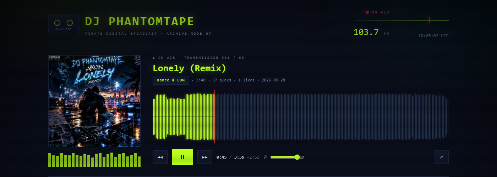
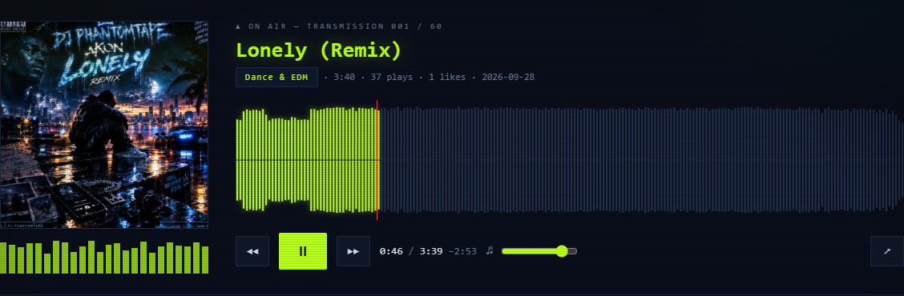

<p align="center">
  
</p>

<h1 align="center">PHANTOMTAPE // 103.7</h1>

<p align="center">
  <a href="https://nortaq-playnexus.github.io/phantomtape-radio/"></a>
  
  
  
  
</p>

```
╔══════════════════════════════════════════════════════════════╗
║  PIRATE DIGITAL BROADCAST :: ARCHIVE NODE 07 :: SIGNAL 07   ║
╚══════════════════════════════════════════════════════════════╝
```

A self-hosted music page for **DJ PHANTOMTAPE** — 60 public tracks off
SoundCloud with real waveforms you can scrub, wearing the same acid-green CRT
grammar as the [GitHub profile](https://github.com/Nortaq-PlayNexus).

**[▶ TUNE IN](https://nortaq-playnexus.github.io/phantomtape-radio/)**

No API key. No OAuth token. No `client_id`. No backend. Just a static site and
the official SoundCloud widget.

---

## The bug worth reading about

The first version resolved CloudFront presigned MP3 links at build time and
wrote them into `catalogue.json`. It looked perfect and was **completely
broken**: those links die about **20 minutes** after SoundCloud issues them.

Measured, not guessed:

| request | result |
|---|---|
| stream URL resolved on the spot | `206 Partial Content` |
| the same URL, 20 minutes later | `403 Forbidden` |

No nightly rebuild can chase that, and `api-v2.soundcloud.com` sends no
`Access-Control-Allow-Origin`, so a browser cannot resolve a fresh one itself.
The whole approach was unsalvageable.

So audio now comes from the official [Widget API][widget], which resolves a
fresh stream per track from its public permalink. The page embeds a widget
iframe, keeps every visible control to itself, and drives the widget over
`postMessage`:

| Ours | Widget's |
|---|---|
| artwork, waveform, rows, filters, stats, CRT styling | the actual audio stream |
| play / pause / next / prev / seek / volume UI | `play()`, `pause()`, `seekTo()`, `setVolume()` |
| waveform playhead and clock | `PLAY_PROGRESS`, `getPosition()`, `getDuration()` |

Bonus: it is the attribution-compliant way to play someone else's audio.

The equaliser bars are driven by the real waveform windowed around the playhead,
not a Web Audio analyser — the stream lives in a cross-origin iframe and cannot
be tapped. Honest about being a visualiser rather than a spectrum analyser.

## Features

- **60 tracks, 3.2 hours**, all public, straight from the profile
- **Real waveforms** — 1800 amplitude samples per track, max-pooled to 600
  points so transients survive the downsample
- **Scrubbable** — click the waveform to jump, or focus it and use arrow keys
  (5s, shift-arrow 30s)
- **Filter and sort** — grep the archive, filter by genre, sort by newest, most
  played, A–Z or runtime
- **Keyboard** — `space` play/pause, `j` next, `k` previous, `/` search

<p align="center">
  
</p>

## Run it

```bash
git clone https://github.com/Nortaq-PlayNexus/phantomtape-radio
cd phantomtape-radio

python -m pip install requests
python tools/build_catalogue.py      # refresh metadata + waveforms

python -m http.server 8777
# open http://127.0.0.1:8777
```

A server is required — `fetch()` will not read `file://` paths.

Deploy by pushing and enabling Pages on the branch. There is no build step, no
bundler, no framework and no secrets to configure.

## Verify it actually plays

```bash
python tools/test_player.py
```

Drives a real browser, clicks play, and asserts the position advances, that
`seekTo` lands, that the next track resolves its own duration, and that the
console stays empty. **If the console is dirty, audio is broken.** This is the
check that would have caught the original bug on day one.

## Layout

```
index.html               the page
assets/style.css         CRT palette, layout, responsive
assets/app.js            widget bridge, waveform renderer, rows, panels
data/catalogue.json      60 tracks: title, genre, duration, plays, artwork, permalink
data/waveforms.json      60 waveform arrays, 600 points each
tools/build_catalogue.py resolve metadata + waveforms
tools/test_player.py     end-to-end playback test
tools/shoot.py           regenerate the screenshots above
```

## Refreshing the catalogue

Only metadata, play counts and waveforms change, and those endpoints are
unauthenticated:

```bash
python tools/build_catalogue.py
```

`.github/workflows/rebroadcast.yml` runs it nightly at 00:17 UTC and commits the
result. Nothing about playback depends on it — the widget always resolves a
live stream, so the site cannot go stale.

## Credits

Audio and artwork belong to DJ PHANTOMTAPE and stay on SoundCloud — this page
links and streams, it does not re-host. Playback uses the official SoundCloud
widget per their [attribution guidelines][attribution].

The MIT licence in `LICENSE` covers this project's own code only. It does not
extend to the music or the cover art.

[widget]: https://developers.soundcloud.com/docs/api/html5-widget
[attribution]: https://developers.soundcloud.com/docs/api/buttons-logos
